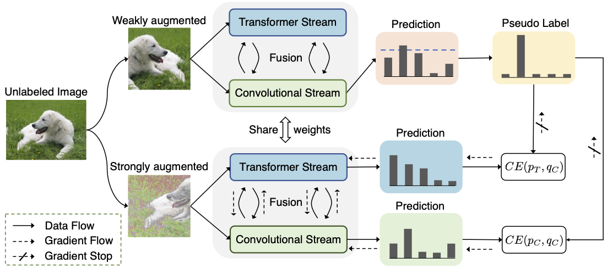

# Semiformer: Semi-Supervised Vision Transformers

**Accepted to ECCV 2022!**

This repository is built upon [DeiT](https://github.com/facebookresearch/deit), [Conformer](https://github.com/pengzhiliang/Conformer), and [timm](https://github.com/rwightman/pytorch-image-models).

# Introduction

We introduce a joint semi-supervised learning framework, **Semiformer**, which contains a transformer stream, a convolutional stream and a carefully designed fusion module for knowledge sharing between these streams. **The convolutional stream is trained on limited labeled data and further used to generate pseudo labels to supervise the training of the transformer stream on unlabeled data.** 

The main framework of the Semiformer is shown as following:



# Getting started

PyTorch 1.7.0+ and torchvision 0.8.1+ and [pytorch-image-models 0.3.2](https://github.com/rwightman/pytorch-image-models)

# Log and Checkpoint downloaded

You can download the log file and the checkpoint file from the following links:

- log: https://drive.google.com/file/d/1oR2e1AP-luOGPPoKWiR03sYE7kTMWdqZ/view?usp=sharing
- checkpoint: https://drive.google.com/file/d/1iWqgVMea9hlU-lBEMsGT-sptFR-PwPr2/view?usp=sharing

# Data Preparation

Download and extract ImageNet train and val images from http://image-net.org/. The directory structure of the ImageNet data is expected as:

```
/path/to/imagenet
  train/
    class 1/
    class 2/
    ...
    class 1000/
  val/
    class 1/
    class 2/
    ...
    class 1000/
```

# Evaluation

Download the [checkpoint](https://drive.google.com/file/d/1iWqgVMea9hlU-lBEMsGT-sptFR-PwPr2/view?usp=sharing) and evaluate the model by the script **"/script/eval.sh"**. You will get the 75.5 Top1 Accuracy. Training process is recorded [here](https://drive.google.com/file/d/1oR2e1AP-luOGPPoKWiR03sYE7kTMWdqZ/view?usp=sharing). 

```bash
# set $ROOT as the project root path
# set $DATA_ROOT as the INet path 
# SET $RESUME_PATH as the downloaded checkpoint path
ROOT=/share/home/jia/workspace/semiformer-codeclean/Semiformer
DATA_ROOT=/share/common/ImageDatasets/imagenet_2012
RESUME_PATH=$ROOT/semiformer.pth

cd $ROOT

export CUDA_VISIBLE_DEVICES=0

python -m torch.distributed.launch --master_port 50131 --nproc_per_node=1 --use_env semi_main_concat_evalVersion.py \
                                   --model Semiformer_small_patch16 \
                                   --data-set SEMI-IMNET \
                                   --batch-size 256 \
                                   --num_workers 4 \
                                   --data-path $DATA_ROOT \
                                   --data-split-file $ROOT/data_splits/files2shards_train_size128116_split1.txt \
                                   --eval \
                                   --resume $RESUME_PATH \
```

# Train

Training scripts of Semiformer are provided in **/script/submitit_Semiformer_*.sh** using submitit. 

You can also train the model directly using DDP without submitit, referring to the DDP script example provided in /script/run_ddp_example.sh. 

# Citation

```
-
```

